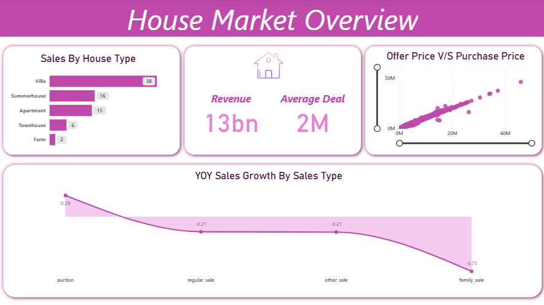
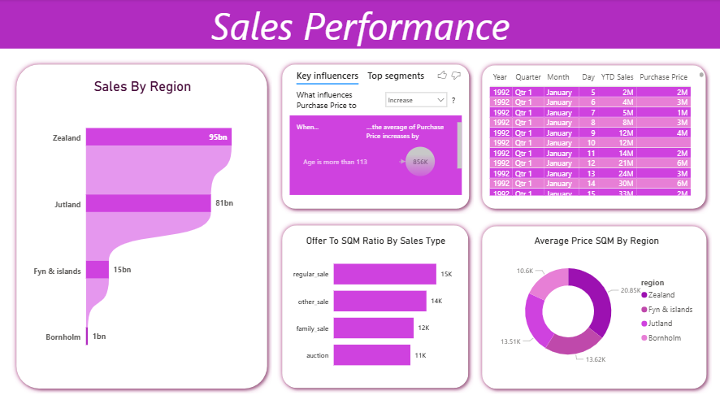

# 🏠 House Market Analysis Dashboard

 

## 📖 Project Overview
This project is a comprehensive analysis of the housing market, designed to provide actionable insights into sales performance, pricing trends, and regional distributions. The dashboard connects directly to **Google BigQuery** for data ingestion, leveraging Power BI's capabilities to visualize complex datasets effectively.

## 🎯 Objective
To build a dynamic reporting solution that allows stakeholders to:
* Monitor total revenue and average deal sizes.
* Compare sales performance across different regions and house types.
* Analyze the correlation between offer prices and purchase prices.
* Identify year-over-year (YOY) growth trends across various sales categories.

## 🛠️ Tech Stack
* **Data Warehouse:** Google BigQuery (SQL)
* **ETL & Modeling:** Power BI (Power Query, DAX)
* **Visualization:** Power BI Desktop

## 📊 Key Features & Dashboard Pages

### 1. Market Overview
* **High-Level KPIs:** Displays Total Revenue (13bn) and Average Deal Size (2M).
* **Sales Distribution:** Breakdown of sales by house type (Villa, Summerhouse, Apartment, etc.).
* **Price Analysis:** Scatter plot visualizing the correlation between Offer Price and Purchase Price.
* **Growth Trends:** Line chart tracking YOY Sales Growth by Sales Type (Auction vs. Regular Sale).

### 2. Sales Performance
* **Regional Analysis:** Funnel chart highlighting top-performing regions (Zealand leading with 95bn).
* **Key Influencers:** AI-driven insights identifying factors that influence purchase price (e.g., property age).
* **Price Metrics:** "Offer to SQM Ratio" comparison and "Average Price SQM by Region" (Donut Chart).
* **Granular Data:** Detailed table view for deep-dive analysis into specific transaction dates and values.

### 3. Property & Financial Metrics
* **Comparative Analysis:** Average Inflation, Interest Rates, and Yields compared against Purchase and Offer prices.
* **House Type Deep Dive:**
    * **Farms:** Highest average price (~2.7M).
    * **Apartments/Villas:** Competitive mid-market pricing.
* **SQM Analysis:** Dual-axis chart comparing Average SQM vs. Average SQM Price across house types.

## 🧠 Key Observations & Insights
1.  **Dominant Regions:** **Zealand** and **Jutland** are the primary revenue drivers, contributing significantly more than Fyn & Islands.
2.  **Top Performers:** **Villas** account for the highest volume of sales (38 units in the snapshot), followed by Summerhouses.
3.  **Sales Type Trends:** **Auctions** are showing positive YOY growth (+0.29), whereas **Family Sales** are seeing a decline (-0.75).
4.  **Price Correlation:** There is a strong positive correlation between offer prices and final purchase prices, indicating a stable valuation environment.
